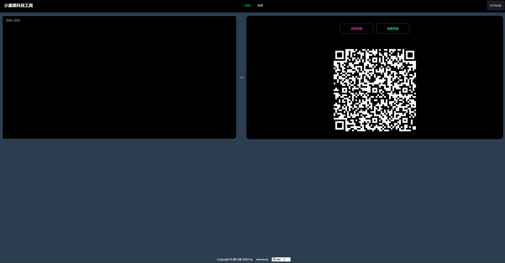

# 小康黑科技

- [https://www.jixiaokang.com/black-tool/#/qrcode](https://www.jixiaokang.com/black-tool/#/qrcode)

> 浙里办单点登录升级改造新的解决办法



## 1.浙里办调试单点登录

- **调试应用（包含本地应用）链接填入后，使用浙里办APP扫码使用**
- **应用绕过了浙里办不安全域名，可以调试任何应用**
- **也可以调试本地应用，兼容单点登录，自动带入ticketId**

## 解决问题

- 1. 通过await ZWJSBridge.ssoTicket({}) 获取到的结果是{result: false,ticketId: null}。·

`ZWJSBridge.ssoTicket` 方法是拿取链接上生成的 ticketId 参数，本地调试和政务中台调试都获取不了

- 2.如何使用扫码工具

- 访问[https://www.jixiaokang.com/black-tool/#/qrcode](https://www.jixiaokang.com/black-tool/#/qrcode)

这里的二维码生成的链接是可以浙理办直接扫码的，用你的手机浙里办 app，可以调试本地应用，本地应用可以加 vconsole 进行调试

2.github 仓库地址
- [https://github.com/xkloveme/black-tool](https://github.com/xkloveme/black-tool)

## 2.表格快速生成

- **根据原型快速生成可配置列表**

## 开始项目
```
npm install
```

### Compiles and hot-reloads for development
```
npm run serve
```

### Compiles and minifies for production
```
npm run build
```

### Lints and fixes files
```
npm run lint
```
